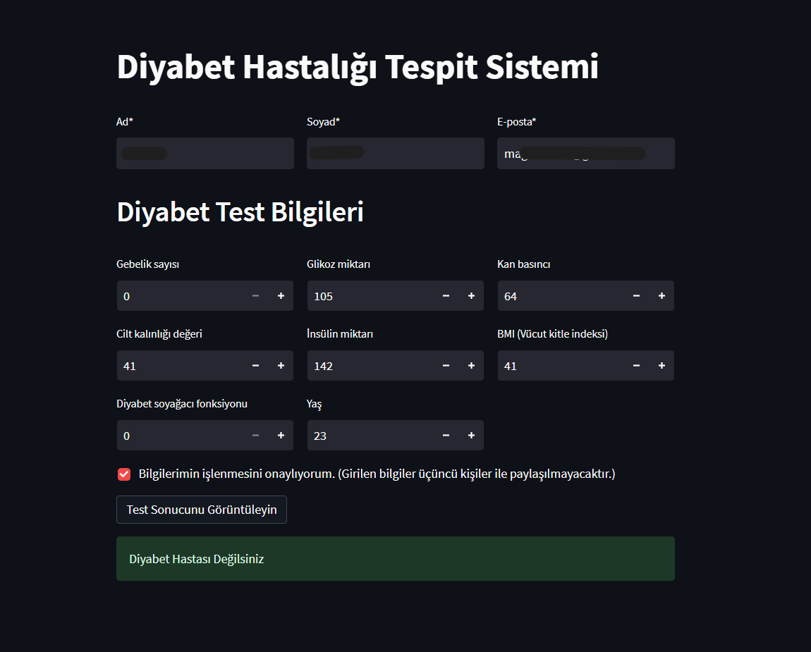

# DiabetsDisease

## About Project
A Diabetes Prediction Web Application from Diabetes Monitoring Dataset and use machine lerning to predict the Diabetes disease. It is part of the design process course at Eskişehir Osmangazi University to learn how the project design process consisted of project presentation.

## To run this Project
Use streamlit command => streamlit run "path file of PredictionSystem.py"

## Technologies utilised

  
  

## UI Screenshots
User Interface of Diabetes Prediction Web Application  
!

## Contributors
* [Hakam Chedo](https://github.com/H4K4M)
* [Hüseyin KAYMAK](https://github.com/hsynkmk)
* [Bengisu ŞAHİN](https://github.com/bengisu-sahin)
* [Muhammet Eren SÖME](https://github.com/erensome)

## Project Supervisor
* Öğr.Gör.Dr.Yıldıray ANAGÜN -Computer Engineering Department, Eskişehir Osmagazi University
* Asst.Prof.İLKER ÖZÇELİK -Software Engıneering Department, Eskişehir Osmagazi University  

